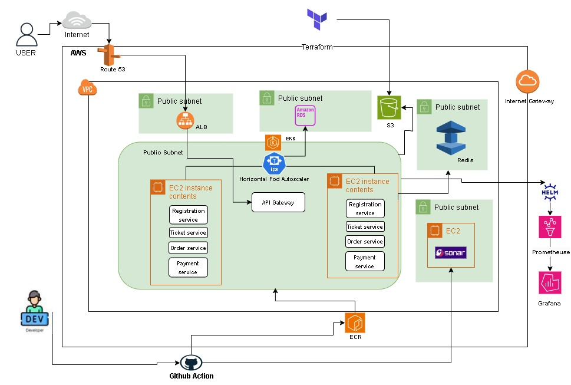
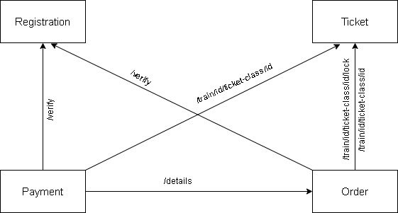
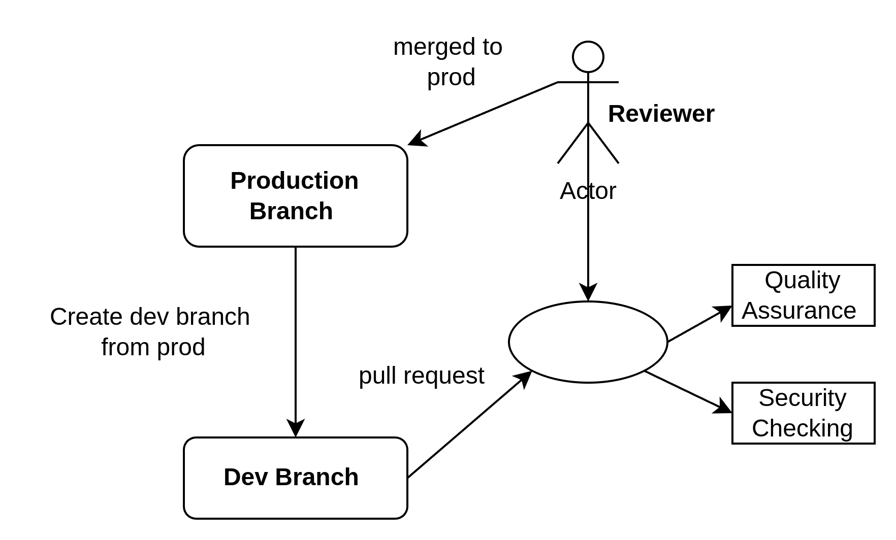
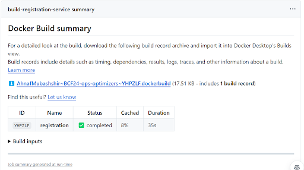
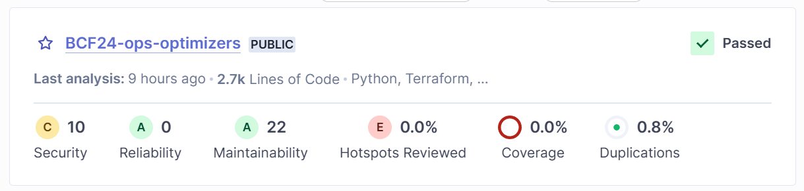
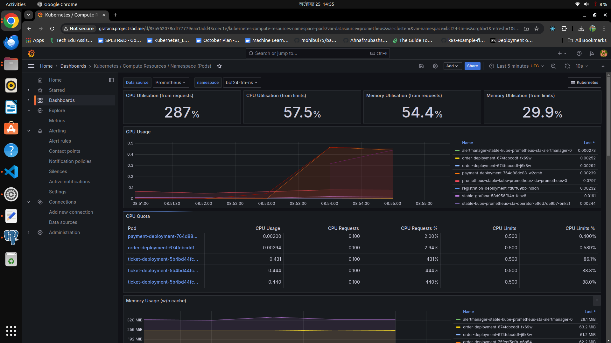
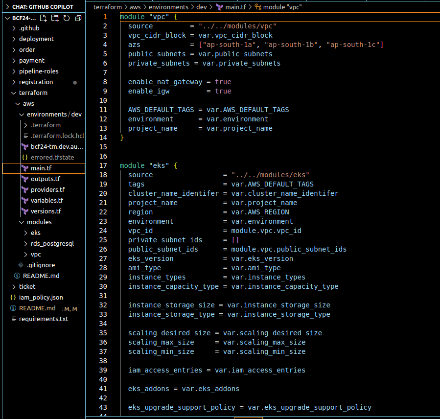
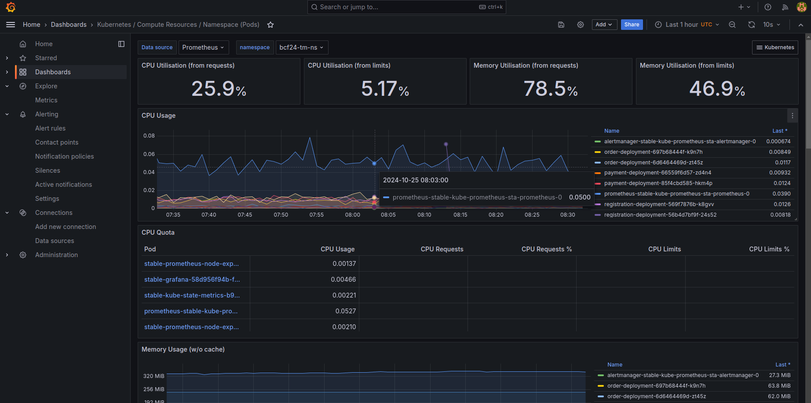

A repository for Buet DevOps Hackathon 2024.

*Project name:* Railway Ticket Management.
*Handled By:* Ops Optimizers-DU

Problem Statement: https://docs.google.com/document/u/1/d/10rDnv2WKcg69sLKj3N6XG24tPgw7GnaXdtYRFAmAqjE/mobilebasic

_Develop a scalable and robust system that can handle lots of traffic and ensure a smooth flow towards buying train tickets online._

Solution: Milestones Strategy. 

### Milestone 1 : System Design

### Milestone 2 : Implementation

*Backend-Service Implementation*:

- Registration Service : Uses OTP to verify email, registers new users, generates access token on successful login and verifies it.

- Ticket Service : Sends all trains and ticket classes lists for viewing, manages the train and ticket database.

- Order Service : Locks the selected seats by user, initiates an ordering process, confirms the order on successful payment, and also releases seats if failed or expired.

- Payment Service : Succeeds payment if lock is still available, otherwise not.

*Inter Service Communication*: 

 

*Dockerizing Microservices in AWS*

*DockerFile:* Separate Dockerfile for each microservice to define the app environment.

*ECR (Elastic Container Registry):* Store Docker images in ECR.Maintain different ECR repositories for each microservice.

*CI/CD Pipeline:* Automate Docker image build and push to ECR using Github Action CI/CD.

*EKS Deployment:* Deploy microservices on EKS (Elastic Kubernetes Service) using the stored images.

*Scaling:* Leverage Kubernetes HPA for dynamic scaling based on resource usage.

*Horizontal Pod Autoscaler (HPA)*
HPA monitors average CPU utilization of Pods and adjusts the number of replicas.

*Target CPU Utilization:* Defined in the HPA *(e.g., 85%)*; HPA maintains CPU usage close to this target.
Scaling Logic:
- Scale Up: Adds Pods if CPU exceeds the target (e.g., CPU > 85%).
- Scale Down: Removes Pods if CPU usage drops below the target.

### Milestone 3 : DevOps Pipeline

*Git Branching Strategy*

*Security Testing*
After running a Pull request ,  a security testing pipeline  is triggered and generate a report. 

*Code Quality Testing*
Besides security testing, Code quality is also checked by Sonarqube.

*Pipeline Phase*
- Build phase 
- Kubernetes secrets generation
- Deployment phase

### Milestone 4 : Load Testing
We run a python script for handling 1 lakh user request in this load testing challenge.

*AWS Elastic cache* (Redis instance) is used for memory cache.

After running thread, CPU utilization arises to nearly 300% without creating replica node by EKS.

_Other milestones cover by this project are_ : 

*IaC Tool (Terraform)* : Provisioned AWS services like : vpc, eks, rds_postgres etc in modular way.

*Service Monitoring* : 
- Prometheus scrapes data from EKS cluster
- Visualize with Grafana Dashboard
- Show various metrics data 

*Zero downTime*:
EKS itself manages Zero-downtime deployments through rolling updates, health checks, and traffic load management.

- Rolling Updates: Gradually replaces old Pods with new ones, ensuring continuous service.
- Readiness & Liveness Probes: Routes traffic only to healthy Pods; restarts unresponsive ones.
- Load Balancing: Directs traffic to available, healthy Pods, preventing service interruptions.
- HorizontalPodAutoscaler (HPA): Adjusts Pod replicas to handle traffic spikes, ensuring availability.

Slide Link : https://docs.google.com/presentation/d/1cpRpeR8MmdgUJ1bpeNmD9HxZgbEtlBsq4BcrPWyjzrY/edit#slide=id.g30e783951b2_0_0

### Run Production Branch!!!!!!!

